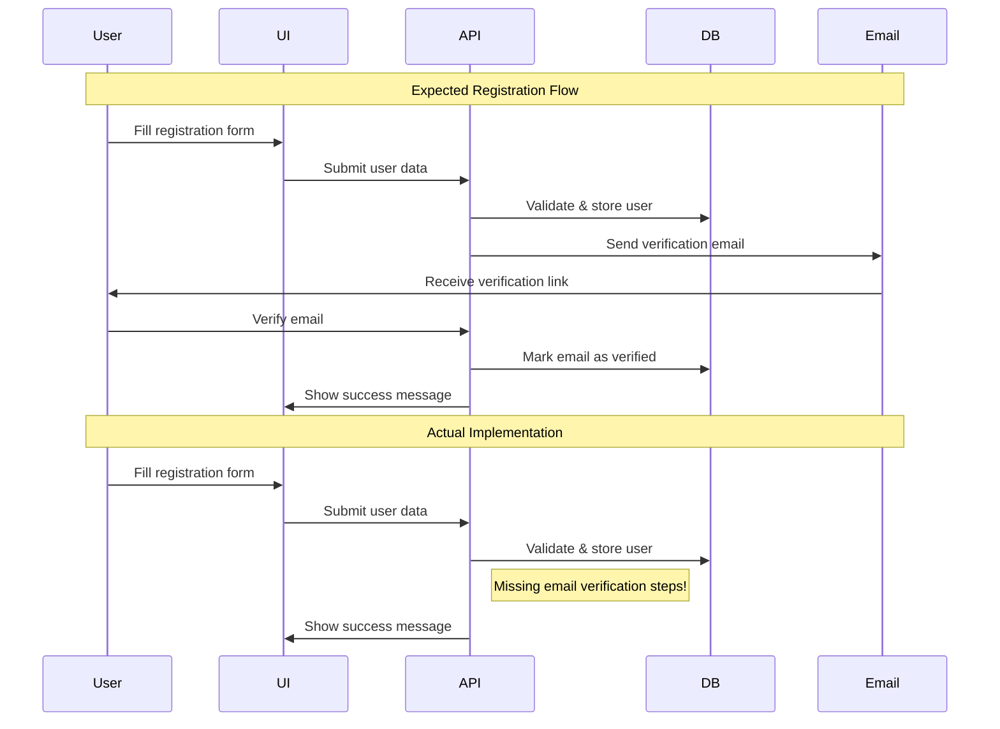

# Workflow Verification Framework Task

## Overview
This task guides the Databutton agent to document and verify actual application workflows, comparing them with expected flows to identify gaps, unexpected behaviors, or implementation inconsistencies. This helps ensure the application behaves as intended and provides a reference for future development.

## How to Use This Prompt
1. Copy the task content below
2. In Databutton, create a new task and paste the content
3. Specify the workflows you want to verify in your request to the agent
4. Start the task to initiate the analysis

## Task Content

```
Title: Verify application workflows and document actual implementation

Description:
Document the actual implementation of key workflows in the application and compare them to expected behavior. This task creates a comprehensive verification of how the application actually works versus how it's intended to work, identifying any gaps or inconsistencies.

Using the Databutton agent tools, follow these steps:
1. Use list_files and read_code to examine the codebase related to the specified workflows
2. Use search_code to find all relevant implementations and interaction points
3. Map out the actual steps in each workflow by tracing through the code
4. Compare the actual workflows to expected behavior (if provided)
5. Generate a well-structured JSON output following the required format
6. Save the JSON analysis using the task_api endpoint

The JSON structure must follow this format:
{
  "taskMetadata": {
    "taskType": "workflow-verification",
    "taskName": "Workflow Verification: [Workflow Names]",
    "createdAt": "[Current ISO date]"
  },
  "summary": {
    "overallStatus": "verified|partial-match|significant-gaps",
    "metrics": {
      "workflowsVerified": 0,
      "workflowsWithGaps": 0,
      "missingSteps": 0,
      "unexpectedSteps": 0
    },
    "keyFindings": [
      "Key finding 1",
      "Key finding 2",
      "Key finding 3"
    ]
  },
  "visualizations": [
    {
      "type": "mermaid",
      "subtype": "sequence",
      "title": "[Workflow Name] - Expected vs Actual",
      "description": "Comparison of expected and actual workflow steps",
      "content": "sequenceDiagram\n  participant User\n  participant UI\n  participant API\n  participant DB\n  Note over User,DB: Expected Flow\n  User->>UI: Action 1\n  UI->>API: Process\n  API->>DB: Store\n  Note over User,DB: Actual Flow\n  User->>UI: Action 1\n  UI->>API: Process\n  Note right of API: Missing step!"
    },
    {
      "type": "mermaid",
      "subtype": "flowchart",
      "title": "Workflow Overview",
      "description": "Map of all verified workflows and their status",
      "content": "graph TD\n  subgraph \"Verified Workflows\"\n    A[Workflow 1] --> A1[All steps match]\n  end\n  subgraph \"Partial Matches\"\n    B[Workflow 2] --> B1[Missing step: X]\n  end\n  subgraph \"Significant Gaps\"\n    C[Workflow 3] --> C1[Implementation not found]\n  end"
    }
  ],
  "sections": [
    {
      "title": "[Workflow Name 1]",
      "priority": 1,
      "content": "### Expected Steps\n1. Step 1\n2. Step 2\n3. Step 3\n\n### Actual Implementation\n1. Step 1\n2. Step 3 (Step 2 is missing)\n\n### Analysis\n- **Missing Steps**: Step 2\n- **Unexpected Steps**: None\n- **Implementation Issues**: [Description of any issues found]\n- **Status**: partial-match"
    },
    {
      "title": "[Workflow Name 2]",
      "priority": 2,
      "content": "..."
    }
  ],
  "actions": [
    {
      "title": "Implement missing workflow step",
      "description": "Add the missing validation step in the registration flow",
      "priority": "high|medium|low",
      "impact": "high|medium|low"
    }
  ],
  "references": [
    {
      "type": "file",
      "path": "src/components/Registration.tsx",
      "description": "Registration form component"
    },
    {
      "type": "file", 
      "path": "src/api/user.py",
      "description": "User API endpoints"
    }
  ]
}

After generating the JSON, use the test_endpoint tool to save it to storage:
- Endpoint name: save_task_result_endpoint
- Request body: { "task_data": YOUR_JSON_OBJECT }

Definition of Done:
- All specified workflows have been analyzed by examining the actual code
- Each workflow is documented with the precise steps in the actual implementation
- For each workflow, any gaps between expected and actual implementation are identified
- Sequence diagrams are created to visualize the expected vs. actual workflow steps
- A flowchart visualization provides an overview of all verified workflows and their status
- Code references are provided for all identified steps
- Specific recommendations are provided for addressing any gaps or issues
- The JSON has been successfully saved using the task API endpoint

Output Format:
The final deliverable should include:
1. The JSON representation of the analysis (saved via API)
2. At least two mermaid visualizations:
   - Sequence diagrams showing expected vs. actual workflow steps
   - A flowchart overview of all analyzed workflows with their status
3. A written summary with an overall assessment of the workflow implementation
4. Prioritized list of actions to address any identified gaps or issues
```

## Example Interaction

**You**: I'd like to verify our user authentication workflows, including registration, login, password reset, and account deletion.

**Agent**: I'll analyze the authentication workflows in your application by examining the actual code implementation and comparing it to expected behavior.

*[Agent works through analyzing the codebase and tracing workflow implementations]*

**Agent**: I've completed the workflow verification for your authentication processes. Here's what I found:

Overall status: **Partial Match** - Some workflows have gaps or implementation differences.

Key findings:
- Registration workflow matches expected behavior except email verification is not implemented
- Login works as expected with proper validation and error handling
- Password reset is missing the security question verification step
- Account deletion workflow is completely implemented as expected

Here's a visualization of the registration workflow:



I've identified 3 key actions to address the gaps:
1. Implement email verification in the registration workflow (High priority)
2. Add security question verification to the password reset flow (Medium priority)
3. Add rate limiting to all authentication endpoints (Medium priority)

The complete analysis has been saved and can be viewed in the Task Results viewer. Would you like me to explain any specific part of the analysis in more detail?

## Tips for Best Results

1. Be specific about which workflows you want to verify
2. If you have documented expected workflows, mention where they can be found
3. Focus on critical user journeys or areas where you suspect implementation might differ from requirements
4. Use this analysis after implementing features but before user acceptance testing
5. Consider running this verification before and after major refactoring to ensure workflows remain intact
